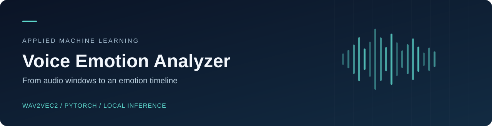
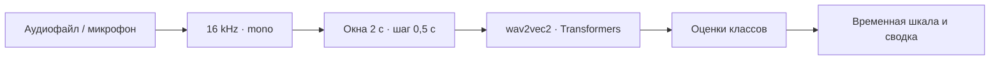

<p align="center">
  
</p>

<p align="center">
  
  
  
  
</p>

# Voice Emotion Analyzer

Приложение для анализа эмоций по голосу на предобученной **wav2vec2**. Загружает аудиофайл или записывает микрофон, выполняет локальный инференс и показывает, как оценки модели меняются во времени.

**Аудио → подготовка сигнала → оконная классификация → временная шкала эмоций.**

## Возможности

- Загрузка WAV/MP3 и запись с микрофона.
- Приведение сигнала к **16 kHz mono** с помощью librosa.
- Анализ окон длительностью **2 секунды** с шагом **0,5 секунды**.
- Инференс через Hugging Face Transformers на CPU или доступном CUDA-устройстве.
- Локальный кеш модели: после первой загрузки используется сохранённая копия.
- График оценок классов, сглаживание и сводка преобладающих эмоций.
- Desktop-интерфейс на CustomTkinter с визуализацией Matplotlib.

## Устройство



| Компонент | Назначение |
| :--- | :--- |
| [`audio/`](audio/) | Загрузка, подготовка и запись аудио |
| [`model/`](model/) | Загрузка модели, кеш и оконный инференс |
| [`analysis/`](analysis/) | Сглаживание и визуализация оценок |
| [`gui/`](gui/) | Интерфейс и пользовательские сценарии |
| [`app.py`](app.py) | Точка входа |

## Быстрый старт

Нужны Python с поддержкой Tk и аудиоустройство. Проверить Tk можно командой `python3 -m tkinter`.

```bash
git clone https://github.com/guguker/Voice-Emotion-Analyzer.git
cd Voice-Emotion-Analyzer
python3 -m venv .venv
source .venv/bin/activate
python -m pip install -r requirements.txt
python app.py
```

В Windows активация окружения: `.venv\Scripts\activate`.

Для записи разрешите приложению доступ к микрофону. Если sounddevice сообщает об отсутствии PortAudio, установите системную библиотеку для своей ОС. На Linux дополнительно может потребоваться пакет Tk.

При первом анализе загружается [`superb/wav2vec2-base-superb-er`](https://huggingface.co/superb/wav2vec2-base-superb-er), поэтому нужен интернет. Сам аудиосигнал обрабатывается локально; в приложении нет отправки записи в облачный API. Кеш `models/`, пользовательские записи и журналы исключены из Git.

## Модель и границы результата

Это проект **интеграции предобученной модели**, без собственного обучения или заявленного результата на независимом тесте.

- Базовая модель различает четыре класса: `neutral`, `happy`, `anger`, `sad`.
- Оба пункта языкового меню используют один английский checkpoint. Отдельной русскоязычной модели и оценки её качества нет.
- Визуализация умеет показывать дополнительные названия эмоций, но это не расширяет набор классов используемой модели.
- Оценки классов не проходили отдельную калибровку. Шум, язык, тембр и длина записи влияют на результат.
- Текущая оконная обработка рассчитана на записи длиннее двух секунд; остаток короче полного окна не анализируется.

## Проверка исходников

```bash
python -m compileall -q app.py audio analysis gui model
```

CI проверяет синтаксис Python без скачивания весов и доступа к микрофону. Реальную работу модели и аудиоустройства следует проверять отдельно на целевой машине.

## Лицензия

Код распространяется по [Apache License 2.0](LICENSE). Для внешней модели действуют условия её репозитория. Аудиозаписи и кеш весов в исходники не включены.
